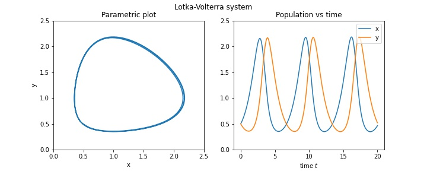

# Parametric plots
Parametric plots trace out the path $(x(t), y(t))$ in the $xy$ plane.
There are two types of examples to consider:
- **Analytic functions** where we have explicit formulas for $x(t)$ and $y(t)$
- **Numerical functions** where $x$ and $y$ are arrays of values (obtained, for example, from `solve_ivp`)

## Example: linear system
Consider the linear system
$$\frac{d}{dt}\begin{pmatrix} x \\ y \end{pmatrix}
=
\begin{pmatrix} 0 & 1 \\ -25 & -6\end{pmatrix}
\begin{pmatrix} x \\ y \end{pmatrix}.$$
One solution is
$$ \begin{pmatrix} x \\ y \end{pmatrix}
=
\begin{pmatrix} e^{-3t}\sin(8t) \\ 8e^{-3t}\cos(8t) - 3e^{-3t}\sin(8t) \end{pmatrix}.$$

To plot this, we define an array of $t$ values, which is used to create arrays of values for $x$ and $y$:
```
t = np.linspace(0,2, 1000)
x = np.exp(-3*t)*np.sin(8*t)
y = 8*np.exp(-3*t)*np.cos(8*t) - 3*np.exp(-3*t)*np.sin(8*t)
```
We then plot using he `plot` function from pyplot:
```
plt.plot(x,y)
plt.axhline(color='black', linewidth=0.5)
plt.axvline(color='black', linewidth=0.5)
plt.xlabel('x')
plt.ylabel('y')
plt.title('A parametric plot')
plt.show()
```
The result is the following:


## Example: simple Lotka-Volterra
Consider the simple Lotka-Volterra system
$$\begin{aligned}
\frac{dx}{dt} &= x - xy\\
\frac{dy}{dt} &= -y + xy
\end{aligned}$$

Using our [previous code for systems](../using_solve_ivp/systems.md), we construct a numerical solution:
```
def f(t,vars):
    x,y = vars
    return [x-x*y, -y + x*y]
    
ic = [0.5, 0.5]
t0 = 0
tmax = 20

soln = solve_ivp( f, [t0, tmax], ic, 
                 t_eval = np.linspace(0, tmax, 1000))
```
We now plot using pyplot:
```
plt.plot(soln.y[0], soln.y[1])
plt.xlabel('x')
plt.ylabel('y')
plt.title('Parametric plot for Lotka-Volterra system')
plt.show()
```
The result is the following:


## Bonus
For the Lotka-Volterra model we can create a graphic that shows both the parametric plot and also the populations vs time:




Here is the code:
```
def f(t,vars):
    x,y = vars
    return [x-x*y, -y + x*y]

# numerical solution
ic = [0.5, 0.5]
t0 = 0
tmax = 20
soln = solve_ivp( f, [t0, tmax], ic, 
                 t_eval = np.linspace(0, tmax, 1000))

# figure setup
plt.figure(figsize=[10,4])
ticks = [0, .5, 1, 1.5, 2, 2.5]

# parametric plot
plt.subplot(121)
plt.plot(soln.y[0], soln.y[1])
plt.xticks(ticks)
plt.yticks(ticks)
plt.xlabel('x')
plt.ylabel('y')
plt.title('Parametric plot')

# plot vs time 
plt.subplot(122)
plt.plot(soln.t, soln.y[0], label='x')
plt.plot(soln.t, soln.y[1], label='y')
plt.yticks(ticks)
plt.xlabel('time $t$')
plt.legend(loc=1)
plt.title('Population vs time')

# finishing touches
plt.suptitle('Lotka-Volterra system')
plt.show()
```