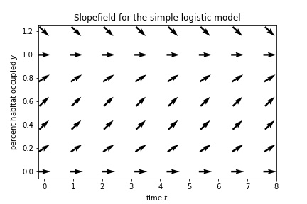
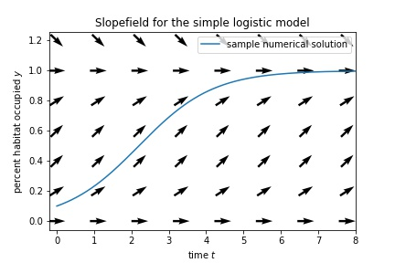

# Slope fields

Let's create a slope field for the simple logistic model 
$$\frac{dy}{dt} = y(1-y).$$
A slope field consists of arrows in the $t,y$ plane that indicate the direction of motion that a solution curve would take at that point:




First, we define the function that determines the right side of the differential equation
```
def f(t,y):
    return y*(1-y)
```

Next, we create a grid of points where the arrows will be located using the NumPy `meshgrid` function.
This requires an array of $t$ values and an array of $y$ values:
```
t = np.linspace(0,10,10)
y = np.linspace(0, 1.2, 7)
```
The `meshgrid` function gives out two arrays, consisting of all the $t$ and $y$ values at each point in the grid. We call these arrays `T` and `Y`
```
T,Y = np.meshgrid(t,y)
```

We plot the arrows using the `quiver` function from pyplot.
This function requires four inputs:
- The horizontal coordinate values `T` for each of the grid points
- The vertical coordinate values `Y` for each of the grid points
- An array giving the horizontal component of the arrow at each point. This array needs to have the same dimensions at `T` and `Y`, and needs to have the value of 1 in each entry. We use the function `np.ones_like(T)` for this array.
- An array giving the vertical component of the arrow at each point. This array is determined by the right side of the equation: `f(T,Y)`

Finally, we include two optional inputs to the `quiver` function:
- `angles='xy'` ensures that the angles are the arrows are calibrated using the coordinate values `T` and `Y`
- `pivot='mid'` centers the arrows on the coordinate points.

We combine all these aspects into the following command:
```
plt.quiver(T, Y, np.ones_like(T), f(T,Y), angles='xy', pivot='mid')
```

It can be fun to include a plot of a numerical solution on top of the slopefield.
This can be done using the code in [the introduction to `solve_ivp`](../using_solve_ivp/one_variable.md)
The result is the following:




## Complete code
Earlier in the notebook/file/console you need:
```
import numpy as np
import matplotlib.pyplot as plt
from scipy.integrate import solve_ivp
```
Then:
```
# function that determines equation
def f(t,y):
    return y*(1-y)

# create and plot numerical solution
t0 = 0.0
tmax = 10
ic = [0.1]
soln = solve_ivp( f, [t0,tmax], ic,
                 t_eval=np.linspace(t0, tmax,1000))
plt.plot(soln.t, soln.y[0],label='sample numerical solution')

# slopefield
t = np.linspace(0,10,10)
y = np.linspace(0, 1.2, 7)
T,Y = np.meshgrid(t,y)
plt.quiver(T, Y, np.ones_like(T), f(T,Y), angles='xy',pivot='mid')

# finishing touches
plt.legend()
plt.xlabel('time $t$')
plt.ylabel('percent habitat occupied $y$')
plt.title('Simple logistic model')
plt.xlim(-0.2,8)
plt.show()
```