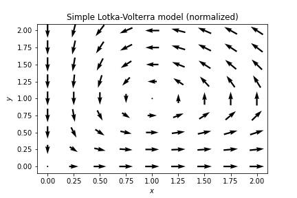

# Vector fields for systems


## Example: simple Lotka-Volterra model
Let's plot the vector field for the simple Lotka-Volterra system$$\begin{aligned}
\frac{dx}{dt} &= x - xy\\
\frac{dy}{dt} &= -y + xy
\end{aligned}$$

First, we define the function that determines the right side of the system:
```
def f(t,vars):
    x,y = vars
    return [x-x*y, -y + x*y]
```
Second, we create a meshgrid of points where the vectors are to be located:
```
x = np.linspace(0,2, 9)
y = np.linspace(0,2,9)
X,Y = np.meshgrid(x,y)
```
We now use the function `f` to determine the horizontal and vertical components of the vectors:
```
Vx = f(0,[X,Y])[0]
Vy = f(0,[X,Y])[1]
```
Finally, we plot the vector field
```
plt.quiver(X,Y,Vx, Vy, angles='xy', pivot='mid')
```
The result is the following:


## Normalizing the vectors
In cases where the vectors are very small and/or very large, it can be useful to normalize the vectors.
We do this by replacing the vector field
$$\langle V_x, V_y\rangle$$
with
$$\left\langle\frac{V_x}{\sqrt{0.1 + V_x^2 + V_y^2}},
\frac{V_y}{\sqrt{0.1 + V_x^2 + V_y^2}}\right\rangle$$
(The $0.1$ terms prevent division by zero.)

For the Lotka-Volterra model, this means plotting with the command
```
plt.quiver(X,Y,Vx/np.sqrt(0.1+Vx**2+Vy**2), Vy/np.sqrt(0.1+Vx**2+Vy**2), angles='xy', pivot='mid')
```
The resulting graphic is:




## Complete code
Earlier in the notebook/file/console you need:
```
import numpy as np
import matplotlib.pyplot as plt
```
Then the normalized plot is generated by
```
# lotka-volterra model
def f(t,vars):
    x,y = vars
    return [x-x*y, -y + x*y]

# create meshgrid
x = np.linspace(0,2, 9)
y = np.linspace(0,2,9)
X,Y = np.meshgrid(x,y)

# vector field components
Vx = f(0,[X,Y])[0]
Vy = f(0,[X,Y])[1]

# plot vector field
plt.quiver(X,Y,Vx/np.sqrt(0.1+Vx**2+Vy**2), Vy/np.sqrt(0.1+Vx**2+Vy**2), angles='xy', pivot='mid')

# finishing touches
plt.title('Simple Lotka-Volterra model (normalized)')
plt.xlabel('$x$')
plt.ylabel('$y$')
plt.show()
```