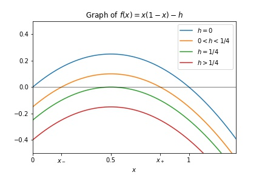

# Functions with a parameter

Suppose we want to plot the function
$$f(x) = x(1-x) - h,$$
where $h \geq 0$.
There are four cases to consider:
- when $h=0$, the roots are $x=0$ and $x=1$
- when $0 < h < \frac{1}{4}$, there are roots at
$$x_{\pm} = \frac{1}{2} \pm \sqrt{\frac{1}{4} - h} $$
- when $h = \frac{1}{4}$, there is a single root at $x = \frac{1}{2}$
- when $h>\frac{1}{4}$, there are no roots

We want to make the following plot that shows all four cases at once:





In the following, we build the code for this plot piece-by-piece.
At the end, we show the complete code.

### Define the function
First, we define the function $f$, including the parameter $h$:
```
# define the function
def f(x,h):
    return x*(1-x) - h
```

### Create lists of $h$ values and corresponding labels
For the purposes of plotting, we need to choose specific values for $h$.
We put those values in a list:
```
hvals = [0, 0.15, 0.25, 0.4]
```
We don't want to label the corresponding plots with these values, so we create a list of strings that will serve as labels for the plots:
```
labels = ['$h=0$', '$0<h<1/4$', '$h=1/4$', '$h>1/4$']
```

### Create the plots
For plotting, we need an array of $x$ values:
```
x = np.linspace(-1,3,1000)
```
To create the plots, we use a loop:
```
for k in range(4):
    plt.plot(x, f(x,hvals[k]), label=labels[k])
    
plt.legend()
plt.show()
```
Note that we access the appropriate $h$ value using `hvals[k]`, which we plug into the function $f$.
Similarly, we access the label using `labels[k]`.

### Adjust plot limits
The range of $x$ values above doesn't yield the ideal plot size.
We use
```
plt.xlim(0, 1.3)
plt.ylim(-0.5,0.5)
```
to restrict the plot. 
This code goes above `plt.show()`.

### Horizontal axis and title
It is nice to include the $x$ axis
```
plt.axhline(color='black', linewidth=0.5)
```
Also, label the plot and the horizontal axis:
```
plt.xlabel('$x$')
plt.title('Graph of $f(x) = x(1-x) - h$')
```
All this goes above `plt.show()` as well.

### Adjust the x axis ticks
The only important points along the $x$ axis are
$$
0\quad x_-\quad 0.5\quad x_+\quad 1.
$$
So we replace the existing tick marks with tick marks showing only these five numbers.

To do this, we first need to compute $x_-$ and $x_+$:
```
xplus = 0.5 + np.sqrt(0.25 - hvals[1])
xminus = 0.5 - np.sqrt(0.25 - hvals[1])
```
Then we use the `plt.xticks()` function, which we give
- a list of the numerical values where we want ticks, and
- a list of labels (either numbers or strings)

The code is
```
plt.xticks([0,xminus, 0.5, xplus,1], [0, '$x_-$', 0.5,'$x_+$', 1])
```

### The complete code
Finally, we can assemble this into a single piece of code:
```
# define the function
def f(x,h):
    return x*(1-x) - h

# h values and labels
hvals = [0, 0.15, 0.25, 0.4]
labels = ['$h=0$', '$0<h<1/4$', '$h=1/4$', '$h>1/4$']

# create plots
x = np.linspace(-1,3,1000)
for k in range(4):
    plt.plot(x, f(x,hvals[k]), label=labels[k])

# adjust plot limits
plt.xlim(0, 1.3)
plt.ylim(-0.5,0.5)
    
# legend, horizontal axis, title
plt.legend()
plt.axhline(color='black', linewidth=0.5)
plt.xlabel('$x$')
plt.title('Graph of $f(x) = x(1-x) - h$')

# axis ticks
xplus = 0.5 + np.sqrt(0.25 - hvals[1])
xminus = 0.5 - np.sqrt(0.25 - hvals[1])
plt.xticks([0,xminus, 0.5, xplus,1], [0, '$x_-$', 0.5,'$x_+$', 1])

plt.show()
```

