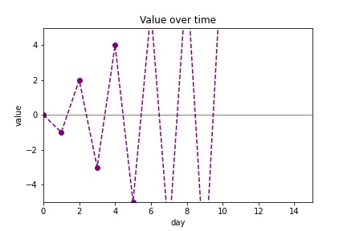

# Plot decorations (labels, axes, titles)
There are additional functions in pyplot to format plots, including:
- `plt.axhline()` used to add a horizontal axis.
Similarly, `plt.axvline()` can be used to add a vertical axis.
- `plt.xlabel()` and `plt.ylabel()` are used to label the horizontal and vertical axes.
- `plt.xlim()` and `plt.ylim()` are used to set the horizontal and vertical limits.

Here is an example that includes all these features:

```
values = [k*(-1)**k for k in range(11)]

plt.plot(values, 
         marker='o',
         color='purple',
         linestyle='dashed')

plt.axhline(color='black', linewidth=0.5)

plt.xlabel('day')
plt.ylabel('value')
plt.title('Value over time')

plt.xlim(0,15)
plt.ylim(-5,5)

plt.show()
```
The result is the following:




To save the figure, replace
```
plt.show()
```
by 
```
plt.savefig('decorated.jpg')
```