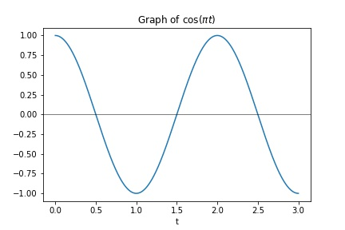
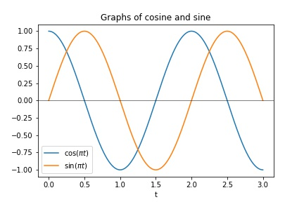

# Plotting functions

In order to plot a function, we require
- a list of input values
- a list of output values

If we have an explicit formula for the function, then the required lists can be easily created using NumPy arrays.

## Example: plotting from a formula
To plot $f(t) = \cos(\pi t)$ for $0\leq t \leq 3$ we first create a list of $t$ values
```
t = np.linspace(0, 3, 1000)
```
Note that we chose 1000 points in the array. This ensures our plot has decent resolution.

Next, we create the values $f(t)$. This is where using NumPy is really handy: we can simply apply the function to the array of $t$ values:
```
f = np.cos(np.pi*t)
```
Finally, we create the plot:
```
plt.plot(t, f)
plt.axhline(color='black', linewidth=0.5)
plt.xlabel('t')
plt.title('Graph of $\cos(\pi t)$')
plt.show()
```
(Note the use of LaTeX in the title string.)
The result:





## Multiple plots at once
To plot multiple functions on the same graphic, simply call `plt.plot()` for each pair of inputs/outputs.

For example:
```
t = np.linspace(0, 3, 1000)
cosine = np.cos(np.pi*t)
sine = np.sin(np.pi*t)

plt.plot(t, cosine)
plt.plot(t, sine)

plt.axhline(color='black', linewidth=0.5)
plt.xlabel('t')
plt.title('Graphs of cosine and sine')

plt.show()
```
When there are multiple functions being plotted, it is convenient to include a legend:
```
t = np.linspace(0, 3, 1000)
cosine = np.cos(np.pi*t)
sine = np.sin(np.pi*t)

plt.plot(t, cosine, label='$\cos(\pi t)$')
plt.plot(t, sine, label='$\sin(\pi t)$')

plt.legend()
plt.axhline(color='black', linewidth=0.5)
plt.xlabel('t')
plt.title('Graphs of cosine and sine')

plt.show()
```
The result is:



