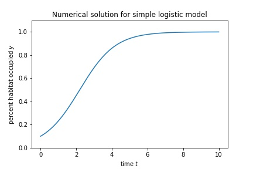

# Introduction: equation with one variable

We create numerical solutions using the `solve_ivp` function from the `scipy.integrate` module, which we import as
```
from scipy.integrate import solve_ivp
```
The `solve_ivp` function requires the following inputs:
- A function that determines the right side of the differential equation. This function must take the form `f(t,vars)`, where `vars` could be a single variable, or (in the case of a system) could represent a list of variables. **Important:** Even if the right sid of the differential equation does not have an explicit $t$ appearing, the function still must be a function of time and the variables.
- Starting and ending times, in the form `[t0, tmax]`
- Initial value(s) of the variable(s), entered as a list. 

We also include the optional argument `t_eval` that indicates the list of times where we want our numerical values.

The `solve_ivp` function returns several outputs, including:
- `t` an array of time values
- `y` an array of values for the unknown(s) at times in `t`

There are many other optional arguments, and several other outputs; see the [solve_ivp documentation](https://docs.scipy.org/doc/scipy/reference/generated/scipy.integrate.solve_ivp.html) for additional details.

## Example: simple logistic model
Consider the equation
$$\frac{dy}{dt} = y(1-y)$$
with the initial condition
$$y(0) = 0.1$$

To construct a numerical solution, we first define a function that determines the right side:
```
def f(t,y):
    return y*(1-y)
```
Next, we define the starting and ending times for the simulation:
```
t0 = 0.0
tmax = 10
```
We specify the initial condition, in the form of a list (that has one entry):
```
ic = [0.1]
```
Finally, we apply the `solve_ivp` function, assigning the outputs to the variable `soln`:
```
soln = solve_ivp( f, [t0,tmax], ic, 
                 t_eval=np.linspace(t0, tmax, 1000)
                )
```

There are two important parts of the object `soln`:
- `soln.t` is the array of $t$ values
- `soln.y` is the array of $y$ values

Thus we can plot, and show, the numerical solution as follows
```
plt.plot(soln.t, soln.y[0])
plt.xlabel('time $t$')
plt.ylabel('percent habitat occupied $y$')
plt.title('Numerical solution for simple logistic model')
plt.ylim(0,1.1)
plt.show()
```
The resulting plot is the following:




## Complete code
Earlier in the notebook/file/console you need:
```
import numpy as np
import matplotlib.pyplot as plt
from scipy.integrate import solve_ivp
```
Then the following code construct the numerical solution and creates the plot:
```
# function that determines equation
def f(t,y):
    return y*(1-y)

# range of time values
t0 = 0.0
tmax = 10

# initial condition
ic = [0.1]

# create numerical solution
soln = solve_ivp( f, [t0,tmax], ic, 
                 t_eval=np.linspace(t0, tmax, 1000)
                )
# plotting               
plt.plot(soln.t, soln.y[0])
plt.xlabel('time $t$')
plt.ylabel('percent habitat occupied $y$')
plt.title('Numerical solution for simple logistic model')
plt.ylim(0,1.1)
plt.show()
```